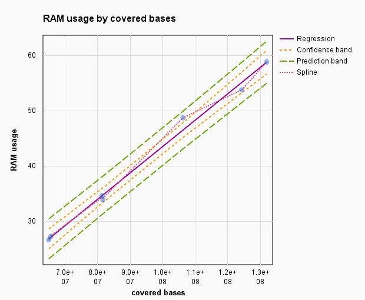

# NucTools

## NucTools is a software package for the analysis of chromatin feature occupancy profiles from high-throughput sequencing data
 
Biomedical applications of high-throughput sequencing methods generate a vast amount of data in which numerous chromatin features are mapped along the genome. The results are frequently analysed by creating binary data sets that link the presence/absence of a given feature to specific genomic loci. However, the nucleosome occupancy or chromatin accessibility landscape is essentially continuous. It is currently a challenge in the field to cope with continuous distributions of deep sequencing chromatin readouts and to integrate the different types of discrete chromatin features to reveal linkages between them. Here we introduce the NucTools suite of Perl scripts as well as MATLAB- and R-based visualization programs for a nucleosome-centred downstream analysis of deep sequencing data. NucTools accounts for the continuous distribution of nucleosome occupancy. It allows calculations of nucleosome occupancy profiles averaged over several replicates, comparisons of nucleosome occupancy landscapes between different experimental conditions, and the estimation of the changes of integral chromatin properties such as the nucleosome repeat length. Furthermore, NucTools facilitates the annotation of nucleosome occupancy with other chromatin features like binding of transcription factors or architectural proteins, and epigenetic marks like histone modifications or DNA methylation.

-------------------------------------------------------------------

## SYSTEM REQUIREMENT

Linux (2.6 kernel or later), Windows 7 x32/64 or Mac (OSX 10.6 Snow Leopard or later) operating system with **minimum 64 GB of RAM** is recommended*. Perl v5.8 or above is required.

The C/C++ compiling environment might be required for installing dependencies, such as bedtools. Systems may vary. Please assure that your system has the essential software building packages (e.g. build-essential for Fedora, XCODE for Mac...etc) installed properly.

NucTools was tested successfully on our Linux servers (CentOS release 6.7 w/ Perl v5.10.1; Fedora release 22 w/ Perl v5.20.3), Macbook Pro laptops (MAC OSX 10.11 w/ XCODE v5.1, 8GB RAM, 4 cores processor), Lenovo ThinkPad laptop (Windows 7, 8Gb RAM, 4 cores processor)

*Memory requirements depend on the experimental system. For big genomes the performance will increase greatly on machines with more memory. For example, the processing of all mouse chromosomes, with the sequencing library size about 30 000 000 reads occupy at the peak load around 60-70 Gb of RAM. It is important to mention that the performance is very dependent on the HDD read-write speed. Therefore the running of many samples in parallel is recommended only on the server-like system or computational clusters with RAID arrays, allowing real multithreaded read-write access to HDDs array.

### aggregate_profile.pl script memory usage.

We used occupancy values from 7 mouse chromosomes with the length from 95 millions of bps (chromosome 17) to 195 millions bps (chromosome 1). 
With the average sequence coverage of 67% and sequencing depth 4.5 folds, computer used 440 Mb of RAM per 1 million bases of a mapped bps.

-------------------------------------------------------------------

## QUICK START 

This is an example of profiling a "test.bed" file using NucTools. The test BED file comes along with the NucTools package
in the "test" directory. More details can be found in the INSTRUCTION section.

1. Obtaining NucTools package:
        
        $ git clone https://github.com/homeveg/nuctools.git NucTools
   
2. Installing NucTools:
   
    the NucTools package does not require installation. It is a collection of individual scripts which can be executed individually.

3. Generate a genome annotation table using the provided R script:
   
        $ Rscript misc/LoadAnnotation.BioMart.R

4. Prepare BED files from BAM files with external application (optionally)

   a. merge multiple replicates to one BAM file and sort by read names:
    
        $ samtools merge -n /Path_to_folder_with/BAM/test_sorted.bam /Path_to_folder_with/BAM/test.rp1.bam /Path_to_folder_with/BAM/test.rp2.bam /Path_to_folder_with/BAM/test.rp3.bam

   b. convert sorted BAM files to BED using bowtie2bed.pl script (or alternatively with an external package bedTools):
   
        $ perl -w bowtie2bed.pl -i /Path_to_folder_with/BAM/test_sorted.bam -verbose > /Path_to_folder_with/BED/test_sorted.bed
        $ bedtools bamtobed -i /Path_to_folder_with/BAM/test_sorted.bam | pigz > /Path_to_folder_with/BED/test_sorted.bed.gz

5. Running NucTools:
   a. Extend single-end reads to the average DNA fragment size
   
        $ extend_SE_reads.pl -in test.bed -out test.ext.bed -fL 147
        
   b. Extract individual chromosomes from the whole-genome BED file
   
        $ extract_chr_bed.pl -in test.ext.bed -out test -d /Path_to_folder_with/BED/ -p chr 
        
   c. Convert all BED files to occupancy OCC files averaging nucleosomes occupancy values over the window of size 10
   
        $ bed2occupancy_average.pl -in /Path_to_folder_with/BED/ -odir /Path_to_folder_with/OCC -dir -use -w 10
        
   d. Calculate aggregate profiles and aligned occupancy matrices for each chromosome individually
    
        $ aggregate_profile.pl -reg genome_annotation.tab -idC 0 -chrC 4 --strC 7 -sC 8 -eC 9 -pbN -lsN -lS <SeqLibSize> \
        -chr 1 -al /Path_to_folder_with/OCC/chr1.test.occ_matrix -av /Path_to_folder_with/OCC/chr1.test.aggregate \
        -in /Path_to_folder_with/OCC/chr1.test.w10.occ -upD 1000 -downD 1000
        
   e. Paste together aggregate profiles of each chromosome in one file and add a header
   
        $ ls /Path_to_folder_with/OCC/*1000_1000.txt | perl -n -e 'if(/.*(chr.*)\.test.*/gm) { print $1, "\t"; }' | \
        perl -n -e 'if( /(.*)\t$/g )  { print $1}' > /Path_to_folder_with/OCC/test.all.occ.txt
        $ echo "" >> /Path_to_folder_with/OCC/test.all.occ.txt

        $ paste /Path_to_folder_with/OCC/*1000_1000.txt >> /Path_to_folder_with/OCC/test.all.occ.txt

6. Optionally: 
Visualize aggregate profiles and run K-mean cluster analysis on aligned occupancy matrixes with the MatLab-based ClusterMaps Building Tool (provided as a part of NucTools package). 
[Download link](https://github.com/homeveg/nuctools/raw/master/CMB/ClusterMaps_Builder_src.zip)

-------------------------------------------------------------------

### Installation

the NucTools suite for a nucleosome-centered downstream analysis of deep sequencing data is primarily Perl-based, and requires at least Perl v5.8 with dependencies installed properly (listed in README_FULL.md). A visualisation program that comes with NucTools is written on MatLab and requires either full MatLab installation or can be provided as a standalone application with web-installer compiled for Windows 7. NucTools utilize whole genome [BED](https://genome.ucsc.edu/FAQ/FAQformat#format1) files.

**Optional external applications:**
    
- [SamTools](http://samtools.sourceforge.net/) - merge, sort and convert BAM files
- [bedtools](http://bedtools.readthedocs.io/en/latest/index.html) - convert BAM to BED
- [PIGZ](http://zlib.net/pigz/) - a parallel implementation of gzip for modern multi-processor, multi-core machines

-------------------------------------------------------------------

### Running NucTools

A typical analysis workflow using NucTools consists of the following steps (see the figure): BAM/SAM files with raw mapped reads are converted to BED format (bowtie2bed.pl), processed to obtain nucleosome-sized reads (extend_SE_reads.pl or extend_PE_reads.pl), and split into chromosomes (extract_chr_bed.pl). Usually, a separate directory with chromosome bed files is created for each sample similarly to the HOMER’s approach. Then chromosome-wide occupancies are calculated and average using a window size suitable for the following analysis (bed2occupancy_average). Then for each cell type/state, an average profile is calculated based on the individual replicate profiles (average_replicates.pl). After this point several types of analysis can be performed in parallel: Finding stable/unstable regions (stable_nucs_replicates.pl); comparing replicate-averaged profiles in different cell states/types (compare_two_conditions.pl); calculating nucleosome occupancy profiles at individual regions identified based on the intersection of stable/unstable regions or regions with differential occupancy with genomic features such as promoters, enhancers, etc (extract_rows_occup.pl); calculating the nucleosome repeat length (nucleosome_repeat_length.pl and plotNRL.R); calculating aggregate profiles or visualizing heat maps of nucleosome occupancy at different genomic features (ClusterMap_Builder). The next types of analysis usually involve gene ontology, multiple-dataset correlations and DNA sequence motif analysis, which can be conducted for the genomic regions of interest identified at the previous steps using external software packages.

The examples below refer to an artificially created input BAM file "test.bam" which we use to run through a NucTools pipeline:

        $ samtools sort -n ./test/test.bam ./test/test_sorted
        $ bowtie2bed.pl -i ./test/test_sorted.bam --verbose > ./test/test_sorted.bed.gz
        $ extend_SE_reads.pl -in ./test/test.bed -out ./test/test.ext.bed.gz -fL 150
        $ extract_chr_bed.pl -in ./test/test.ext.bed.gz -out test/BED -d ./test -p chr 
        $ bed2occupancy_average.pl -in ./test/BED -odir ./test/OCC -dir -use -w 10
        $ aggregate_profile.pl -reg genome_annotation.txt -idC 0 -chrC 4 -strC 7 -sC 8 -eC 9 -pbN -lsN -lS 75000000 -chr 1 -al ./test/OCC/chr1.test.occ_matrix -av ./test/OCC/chr1.test.aggregate -in ./test/OCC/chr1.test.w10.occ.gz -upD 1000 -downD 1000

In this example the test.bam file is sorted by the reads names and converted to test_sorted.bed.gz file. In this case we are dealing with single-end ilumina sequencing reads with the read length of 100 bp and average expected DNA fragment length 150 bp. The reads are extended using extend_SE_reads.pl, then the resulting whole-genome BED file is divided to chromosomes with extract_chr_bed.pl and all per-chromosome BED files are converted to OCC files with bed2occupancy_average.pl using a running window 10bp. ON the last step an aggregate profile around regions specific in genome_annotation.txt is generated using aggregate_profile.pl script 

-------------------------------------------------------------------

## NucTools scripts

### Initial data transformation

   * ### bowtie2bed.pl
   takes as an input standard SAM, BAM or MAP file and converts to the gzip-compressed BED file. The program require samtools installed in PATH to be able to work with BAM files
   
        $ perl -w bowtie2bed.pl --input=accepte_hits.bam --output=sample.bed.gz [--verbose --help]
   
   * ### extend_SE_reads.pl
   extends single-end reads by the user-defined value of the average DNA fragment length. Script works with compressed or uncompressed BED files and save output as compress *.BED.GZ
   
        $ perl -w extend_SE_reads.pl -in <in.bed> -out <out.bed> -fL <fragment length> \
        [-cC <column Nr.> -sC <column Nr.> -eC <column Nr.> -strC <column Nr.> ] [--help] 
   
   * ### extend_PE_reads.pl
   takes as an input BED file with mapped paired-end reads (two lines per paired read) sorted according to the read name and reformat it by creating a smaller BED file with one line per nucleosome in the following format: (1) chromosome, (2) nucleosome start, (3) nucleosome end, (4) nucleosome length
    
        $ perl -w extend_PE_reads.pl -in <in.bed> -out <out.bed> [--help] 
   
   * ### calc_fragment_length.pl
   estimates mean fragment length for a single-end sequencing based on BED file analysis. The value can be used for single end reads extention
    
        $ perl -w perl -w calc_fragment_length.pl --input=<in.bed> --output=<filtered.txt> [--delta=<N> --apply_filter \
        --filtering_threshold=<N> --pile=<N> --fix_pile_size ] [--chromosome_col=<column Nr.> --start_col=<column Nr.> \
        --end_col=<column Nr.> --strand_col=<column Nr.> --help]
   
   * ### extract_chr_bed.pl
   splits whole genome BED file with mapped reads into smaller BED files per each chromosome
    
        $ perl -w extract_chr_bed.pl -in all_data.bed.gz -out output_name_template -p [<pattern>] [--help] 
   
   * ### bed2occupancy_average.pl
   calculates genome-wide nucleosome occupancy, based on the BED file with sequencing reads. It converts BED files for all or specified chromosomes. The running window occupancy file (*.OCC) is a text file containing normalized reads frequency distribution along each chromosome in the running window.
    
        $ perl -w bed2occupancy_average.pl --input=<in.bed.gz> --output=<out.occ.gz> \
        [--outdir=<DIR_WITH_OCC> --chromosome_col=<column Nr.> --start_col=<column Nr.> --end_col=<column Nr.> \
        --strand_col=<column Nr.> --window=<running window size> --consider_strand --ConvertAllInDir --help]
   
-------------------------------------------------------------------

### Core scripts

   * ### aggregate_profile.pl
   Calculates aggregate profile of sequencing read density around genomic regions. As an input it utilzes a tab-delimited text file or BED file with coordinates of genomic features (promoters, enhancers, chromatin domains, TF binding sites, etc), and the OCC files with continuous chromosome-wide occupancy (nucleosome occupancy, TF distribution, etc). Calculates normalized occupancy profiles for each of the features, as well as the aggregate profile representing the average occupancy centered at the middle of the feature
    
        $ perl -w aggregate_profile.pl --input=<in.occ.gz> --regions=<annotations.txt> [--expression=<gene_expression.rpkm>] \ 
        --aligned=<output.aligned.tab.gz> --average_aligned=<output.aggregare.txt> \ 
        [--path2log=<AggregateProfile.log> --region_start_column=<column Nr.> --region_end_column=<column Nr.> \
        --strand_column=<column Nr.> --chromosome_col=<column Nr.> --GeneId_column=<column Nr.> \
        --Expression_columnID=<column Nr.> --Methylation_columnID=<column Nr.> --Methylation_columnID2=<column Nr.> \
        --upstream_delta=<column Nr.> --downstream_delta==<column Nr.> --upper_threshold=<column Nr.> --lower_threshold=<column Nr.> \
        --Methylation_threshold=<value|range_start-range_end> --overlap=<length> --library_size=<Nr.> \
        --remove_minus_strand | --ignore_strand | --fixed_strand=[plus|minus] --invert_strand --input_occ --score --dont_save_aligned \
        --Cut_tail --chromosome=chrN --AgregateProfile --GeneLengthNorm --LibsizeNorm --PerBaseNorm --useCentre \
        --use_default --verbose --help ]

   * ### average_replicates.pl
   Calculates the average occupancy profile and standard deviation based on several replicate occupancy profiles from the working directory and save resulting table, including input occupancy data for individual files. Input *.occ files can be flat or compressed. Resulting extended occupancy file will be saved compressed
    
        $ perl -w average_replicates.pl --dir=<path to working dir> --output=<path to results file> --coordsCol=0 \
        --occupCol=1 --pattern="occ.gz" --printData --sum [--help]  
   
   * ### calc_fragment_length.pl
   Estimates mean fragment length for a single-emd sequencing library
    
        $ perl -w calc_fragment_length.pl --input=<in.bed> --output=<filtered.txt> \
        [--delta=<N> --apply_filter --filtering_threshold=<N> --pile=<N> --fix_pile_size ] \ 
        [--chromosome_col=<column Nr.> --start_col=<column Nr.> --end_col=<column Nr.> --strand_col=<column Nr.> --help]
   
   * ### nucleosome_repeat_length.pl
   Calculates frequency of nucleosome-nucleosome distances to determine the nucleosome repeat length
     
        $ perl -w nucleosome_repeat_length.pl --input=<in.bed> --output=<filtered.txt> \
        [--delta=<N> --apply_filter --filtering_threshold=<N> --pile=<N> --fix_pile_size ] \
        [--chromosome_col=<column Nr.> --start_col=<column Nr.> --end_col=<column Nr.> --strand_col=<column Nr.> --help]
   
   * ### stable_nucs_replicates.pl
   Finds stable and fussy nucleosomes using all replicates for the same experimental condition
     
        $ perl -w stable_nucs_replicates.pl --input=<path to input DIR> --output=<out.bed> --chromosome=chr1 \
        [-coordsCol=0 -occupCol=2 -StableThreshold=0.5 --printData ] [--help] 
   
-------------------------------------------------------------------
 
### Vizualization and additional scripts

   * ### LoadAnnotation.BioMart.R
   R script to retrieve genes annotation from EnsEMBL using Bioconductor BioMart package. Genes annotation table, particulary TSS/TTS coordinates, chromosomes and strand inforamtion is used with aggregate_profile.pl as a genomic features table.
   
   * ### plotNRL.R
   Peak detection R script to estimate NRL based on nucleosome_repeat_length.pl output.
   
   * ### CMB - Cluster Maps Builder
   Aggregate profile and aligned occupancy matrix visualizer. MatLab-based stand-alone GUI application, compiled to run on Windows (tested on Winows 7)

-------------------------------------------------------------------

## Additional information

Additional information, publications references and short description of each script from the toolbox can be found here:

  - http://www.generegulation.info/index.php/nuctools (external link)
  - https://homeveg.github.io/nuctools/ (GitHub pages)
  - http://link.springer.com/article/10.1186/s12864-017-3580-2 (BMC Genomics)

### How to cite

   Vainshtein, Y., Rippe, K. & Teif, V.B.
   BMC Genomics (2017) 18: 158.
   doi:10.1186/s12864-017-3580-2

### Future possible modifications

- parallel processing (beautiful codes snippets for implementation of parallel processing of BAM files with Perl one can find here: https://genomebytes.wordpress.com/2013/07/24/multi-thread-access-of-bam-files-using-perl-and-samtools/ )
- NucTools automated package installation with make

### Developers: 
Yevhen Vainshtein and Vladimir B. Teif
